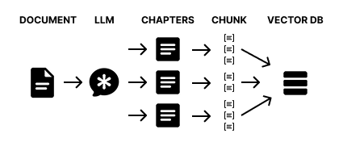

# MultilevelRAG

## PREMISE

Simply breaking an entire document into regular CHUNKs has some disadvantages:
- It does not allow you to incorporate all the semantics of the context because the cut can potentially occur at any point
- If the information is integrated into a longer context, you lose information

In fact, for very structured topics it is preferable to use GraphRAG, which remains the best solution even if it is more complex to implement.
So I implemented this technique that I used in my project and it worked pretty well.
It has probably already been implemented (and certainly even better than what I did).

[sandbox project](https://codesandbox.io/p/devbox/embedding-d3x34d?file=%2Fsrc%2FrunChat.ts%3A3%2C1)

> I KNOW it's typescript and not python! I'm used to using typescript!
> The code is very simple and can be translated by eye.
> However, the bulk of the work was the descriptions of the `llm`.

If you download it, you can run it by putting your google gemini `API_KEY` in `.env`
The demo processes a text (a tourist manual for Rome) and inserts it into the VECTOR DB:
`npm run storeDB`

Then you can chat to get information:
`npm run chat`

Or put a breakpoint and debug the selected file with the `launch.json`.

If you are crazy, you can also FORK by putting your API_KEY in the `.env` and run directly in the online sandbox.

## SOLUTION

### STORE the DOCUMENT on multiple levels
The idea is to ask an LLM to break the DOCUMENT into semantically coherent CHAPTERS.
These CHAPTERS are in turn divided into text BLOCKS (chunks) with the classic splitting techniques.
The BLOCKS maintain a reference to the CHAPTER from which they come.
And, finally, the BLOCKS are embedding and stored in the VECTOR DB (lancedb).

### RECOVERY via QUERY
When I receive a QUERY I generate its embedding vector.
I use the VECTOR DB and obtain an array of text BLOCKS (those previously stored) semantically similar to the QUERY.
Each text BLOCK has a reference to the CHAPTER from which it was generated so I recover the relevant CHAPTERS.

This allows you to recover an entire portion of text semantically consistent with the QUERY therefore useful for the RAG.

## KB CREATION

Ok I have a DOCUMENT and I want to put it into a VECTOR DB, how do I do it?
Look at this [code](https://codesandbox.io/p/devbox/embedding-d3x34d?file=%2Fsrc%2FstoreInDB.ts%3A14%2C20)

I basically pass the DOCUMENT to the LLM and he decides how to divide it into CHAPTERS [here](https://codesandbox.io/p/devbox/embedding-d3x34d?file=%2Fsrc%2Fcutter%2Fllm.ts%3A17%2C23-17%2C40).
This operation is performed on many tokens (the whole document) so it can be "heavy": It must be done with a single interaction and a few tricks.

> FUN FACT:
> If you give an LLM (gemini-2.0-flash) a very long document and ask it to return the CHAPTERS
> it could take a very long time to complete the operation
> or give you an error (it gave me one) because it has to re-generate all the tokens of the document itself!

The idea is to have the LLM return only the references of where each single CHAPTER begins
This allows to reduce the length of the response to a minimum and therefore speed it up a lot.

> FUN FACT:
> If you ask an LLM to give you a numerical position
> for example: the number of characters from the beginning of the document after which a CHAPTER begins... it will surely get it wrong!
> As you know an LLM cannot count the characters correctly since it uses TOKENS.

The trick is to get the first X words of the beginning of the CHAPTER.
This does it "pretty" well.

> FUN FACT:
> If you ask, even with threats, an LLM to return a list ordered in a certain way, sometimes he puts it in order, sometimes "almost".

I had to implement a system to make sure I get the right chapter [here](https://codesandbox.io/p/devbox/embedding-d3x34d?file=%2Fsrc%2Fcutter%2Futils.ts%3A1%2C17-1%2C27)

So now LLM has created the CHAPTER indexes and we have extracted them from the DOCUMENT
Then it's all very simple:
- I break the CHAPTER into text BLOCKS keeping the reference to the CHAPTER
- I get the embedding of the text BLOCKS
- I store in the VECTOR DB
[code](https://codesandbox.io/p/devbox/embedding-d3x34d?file=%2Fsrc%2FstoreInDB.ts%3A44%2C2-60%2C4)

> FUN FACT:
> if you want to improve much the performance of the EMBEDDING always opt for batch API calls.
> GEMINI generates 100 EMBEDDING at most per API call
> [here](https://codesandbox.io/p/devbox/embedding-d3x34d?file=%2Fsrc%2Futils%2FembeddingGemini.ts%3A27%2C1-46%2C2)

## CHAT

To start the CHAT you can run
`npm run chat`
or launch the file `runChat.ts`
It is a ReAct AGENT with a TOOL to query the VECTOR DB [here](https://codesandbox.io/p/devbox/embedding-d3x34d?file=%2Fsrc%2Fchat.ts%3A8%2C1)
The implementation of the base class "Agent" deserves a separate discussion.

The retrieval from the DB takes place [here](https://codesandbox.io/p/devbox/embedding-d3x34d?file=%2Fsrc%2FqueryDB.ts%3A6%2C23-6%2C30). That is:
- I query the VECTOR DB for semantic similarity through the EMBEDDING of the QUERY
- I retrieve a list of text BLOCKS (or even directly CHAPTERS if necessary)
- Of these text BLOCKS I retrieve the CHAPTERS and assign them the distance of the "best" BLOCK
- Then I obtain a list of CHAPTERS ordered by "semantic distance" from the QUERY
- I enrich the prompt with the CHAPTERS found (I put the first two but it could also be three!)

## WHAT ELSE COULD BE DONE

There are, in my opinion, at least two important optimizations:

- When LLM splits the document into chapters it should also create an index or summary.
This would allow the agent to understand what the entire document is about.
Otherwise, when asked "what can I do in Rome?" (in the demo I used the text of a tourist guide for Rome) he should theoretically download all the knowledge.

- A sub-agent should be created to handle queries to the vector database instead of the leader agent
This would allow the request to be handled without cluttering the leader agent's window